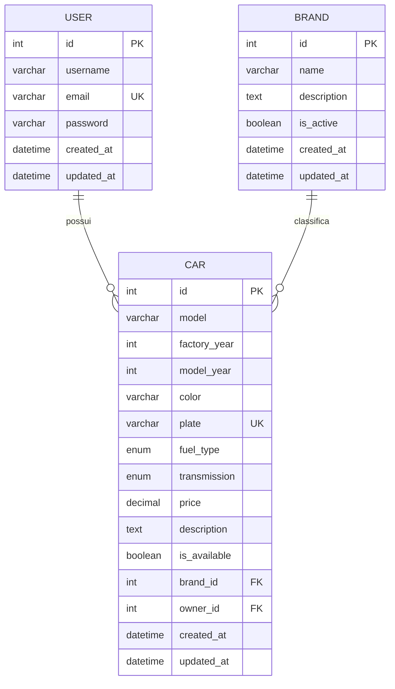
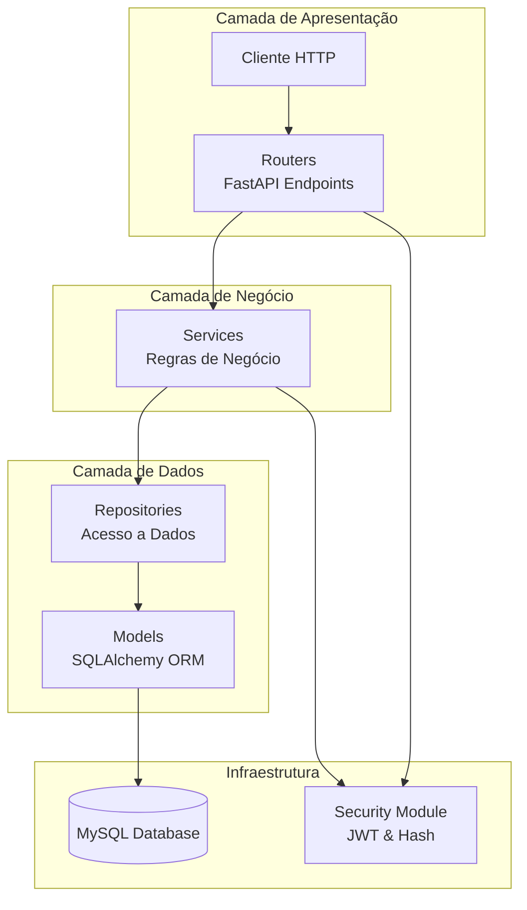
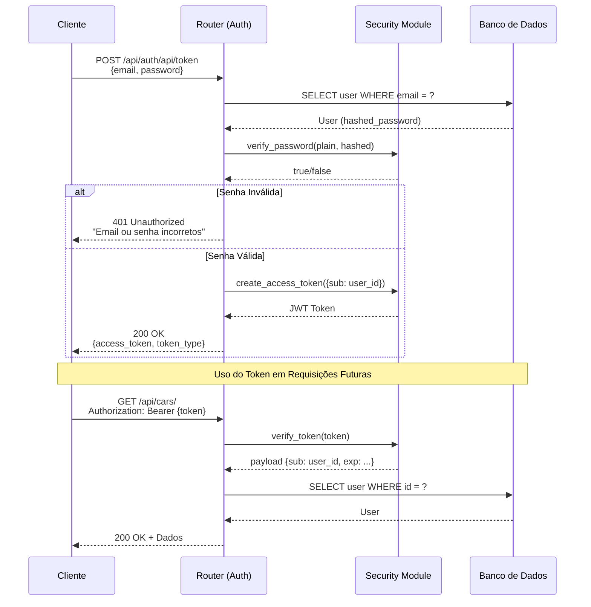
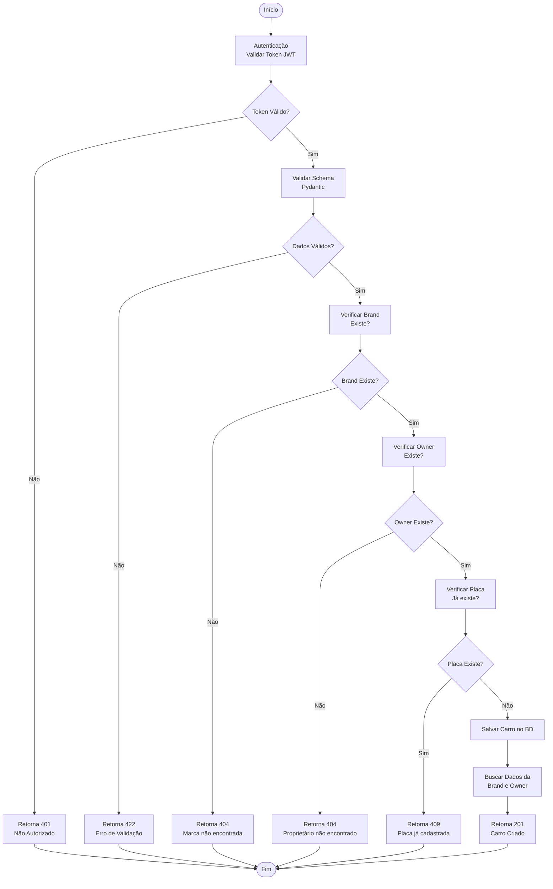
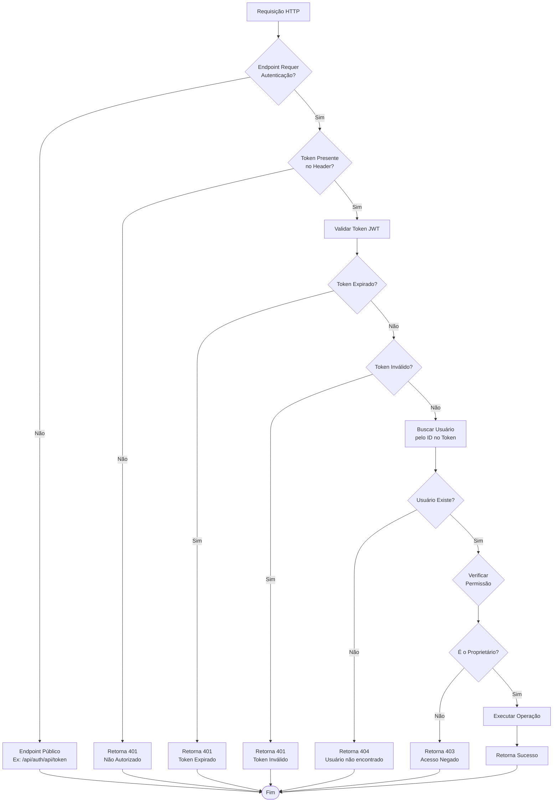
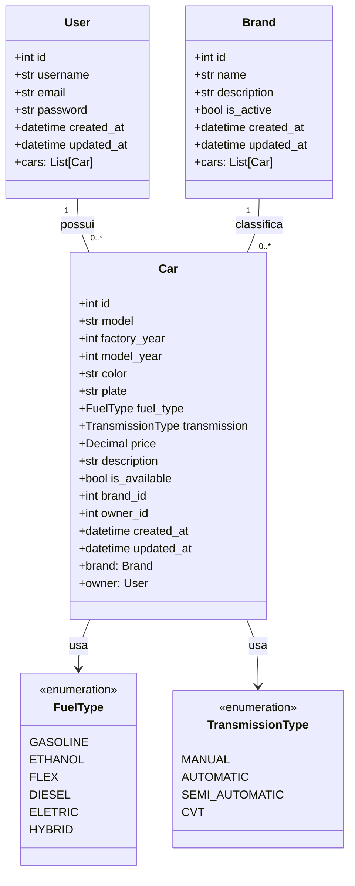
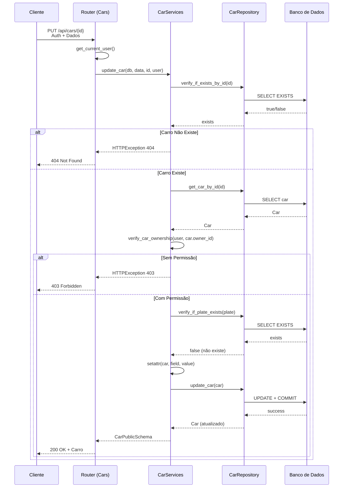

# Modelagem do Sistema

Este documento apresenta a modelagem de dados e arquitetura do sistema CAR API, incluindo diagramas visuais que ilustram a estrutura e os fluxos principais da aplicação.

---

## 📊 Modelos de Dados (ERD)

O sistema é composto por três entidades principais: **User**, **Car** e **Brand**.



### Relacionamentos

| Relacionamento | Tipo | Descrição |
|----------------|------|-----------|
| User → Car | 1:N | Um usuário pode possuir vários carros |
| Brand → Car | 1:N | Uma marca pode classificar vários carros |

---

## 🏗️ Arquitetura do Sistema

A CAR API segue uma arquitetura em camadas (Layered Architecture) com separação clara de responsabilidades.



### Descrição das Camadas

| Camada | Responsabilidade | Localização |
|--------|------------------|-------------|
| **Routers** | Receber requisições HTTP, validar schemas, retornar respostas | `car_api/routers/` |
| **Services** | Aplicar regras de negócio, validações complexas | `car_api/services/` |
| **Repositories** | Executar operações de banco de dados | `car_api/repositories/` |
| **Models** | Definir estrutura das tabelas | `car_api/models/` |
| **Schemas** | Validar e serializar dados | `car_api/schemas/` |
| **Security** | Autenticação JWT, hash de senhas | `car_api/core/security.py` |

---

## 🔐 Fluxo de Autenticação

Diagrama de sequência do processo de autenticação e geração de token JWT.



### Etapas do Fluxo

1. **Login:** Cliente envia email e senha
2. **Busca Usuário:** Sistema busca usuário no banco
3. **Verifica Senha:** Compara senha com hash armazenado (Argon2)
4. **Gera Token:** Cria JWT com `sub` = user_id e expiração
5. **Retorna Token:** Cliente recebe token para uso futuro
6. **Requisições Autenticadas:** Cliente envia token no header `Authorization: Bearer`
7. **Valida Token:** Sistema verifica validade e extrai user_id
8. **Busca Usuário:** Obtém dados completos do usuário

---

## 🚗 Fluxo CRUD de Carros

Diagrama de fluxo do processo de criação de um carro (Create).



### Validações do Fluxo

| Validação | Descrição | Código de Erro |
|-----------|-----------|----------------|
| Token JWT | Verifica se usuário está autenticado | 401 |
| Schema | Valida dados de entrada com Pydantic | 422 |
| Brand | Verifica se marca existe | 404 |
| Owner | Verifica se proprietário existe | 404 |
| Plate | Verifica unicidade da placa | 409 |

---

## 🔒 Fluxo de Segurança

Diagrama do sistema de permissões e controle de acesso.



### Níveis de Permissão

| Tipo de Endpoint | Permissão Necessária | Exemplo |
|------------------|---------------------|---------|
| **Público** | Nenhuma | `POST /api/auth/api/token` |
| **Autenticado** | Token JWT válido | `GET /api/brands/` |
| **Owner (Usuário)** | Token + Mesmo user_id | `PUT /api/users/{id}` |
| **Owner (Carro)** | Token + Dono do carro | `DELETE /api/cars/{id}` |

### Funções de Segurança

```python
# car_api/core/security.py

# Hash de senha
get_password_hash(password: str) -> str
verify_password(plain_password, hashed_password) -> bool

# JWT
create_access_token(data: Dict) -> str
verify_token(token: str) -> Dict

# Autenticação
authenticate_user(email, password, db) -> User | None
get_current_user(credentials, db) -> User

# Permissões
verify_user_permission(current_user, user_id) -> None
verify_car_ownership(user, car_owner_id) -> None
```

---

## 📦 Diagrama de Classes



---

## 🔄 Diagrama de Sequência - Atualização de Carro



---

## 📊 Resumo dos Modelos

### User (Usuário)

| Campo | Tipo | Descrição |
|-------|------|-----------|
| `id` | int | Chave primária |
| `username` | varchar(100) | Nome de usuário |
| `email` | varchar(255) | Email único |
| `password` | varchar(255) | Senha com hash Argon2 |
| `created_at` | datetime | Data de criação |
| `updated_at` | datetime | Data de atualização |

### Car (Carro)

| Campo | Tipo | Descrição |
|-------|------|-----------|
| `id` | int | Chave primária |
| `model` | varchar(100) | Modelo do veículo |
| `factory_year` | int | Ano de fabricação |
| `model_year` | int | Ano modelo |
| `color` | varchar(100) | Cor do veículo |
| `plate` | varchar(20) | Placa (única) |
| `fuel_type` | enum | Tipo de combustível |
| `transmission` | enum | Tipo de transmissão |
| `price` | decimal(15,2) | Preço |
| `description` | text | Descrição |
| `is_available` | boolean | Disponível para venda |
| `brand_id` | int | Chave estrangeira (Brand) |
| `owner_id` | int | Chave estrangeira (User) |

### Brand (Marca)

| Campo | Tipo | Descrição |
|-------|------|-----------|
| `id` | int | Chave primária |
| `name` | varchar(100) | Nome da marca |
| `description` | text | Descrição |
| `is_active` | boolean | Status ativo/inativo |
| `created_at` | datetime | Data de criação |
| `updated_at` | datetime | Data de atualização |

---

## 📚 Próximos Passos

Compreendida a modelagem:

1. [Autenticação e Segurança](authentication.md) - Detalhes sobre segurança
2. [API Endpoints](api-endpoints.md) - Explore os endpoints
3. [Desenvolvimento](development.md) - Comece a desenvolver

---

**Referência:** Para mais detalhes sobre implementação, consulte os arquivos em `car_api/models/`.
